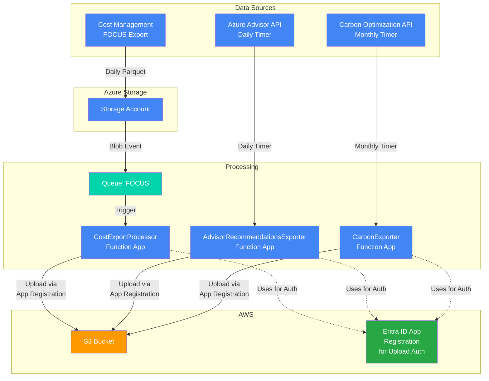

<!-- markdownlint-disable -->

<!-- markdownlint-restore -->
<!--
  ***** CAUTION: DO NOT EDIT ABOVE THIS LINE ******
-->


# terraform-azure-focus

## Description

This Terraform module exports Azure cost-related data and forwards to AWS S3. The supported data sets are described below:

- **Cost Data**: Daily parquet files containing standardized cost and usage details in FOCUS format; daily schedule requires an end date - defaults to 10 years from deployment but can be changed with module variable `cost_export_daily_schedule_to_years`
- **Azure Advisor Recommendations**: Daily JSON files containing cost optimization recommendations from Azure Advisor
- **Carbon Emissions Data**: Monthly JSON reports with carbon footprint metrics across Scope 1 and Scope 3 emissions

> [!NOTE]  
> There is currently an [issue](https://github.com/hashicorp/terraform-provider-azurerm/issues/29993?source=post_page-----99ff43c1557f---------------------------------------) with publishing Function App code on the Flex Consumption Plan using a managed identity. We have had to revert to using the storage account connection string for now. More details can be found [here](https://medium.com/azure-terraformer/azure-functions-with-flex-consumption-and-managed-identity-is-broken-99ff43c1557f) (behind a paywall, sadly).

## Architecture

This module creates a fully integrated solution for exporting multiple Azure datasets and forwarding them to AWS S3. The following diagram illustrates the data flow and component architecture for all three export types:



### Data Flow

The module creates three distinct export pipelines for each of the data sets:

#### FOCUS Cost Data Pipeline
1. **Daily Export**: Cost Management exports daily FOCUS-format cost data (Parquet files) to Azure Storage
2. **Event Trigger**: Blob creation events trigger the `CostExportProcessor` function via storage queue
3. **Processing**: Function processes and transforms the data (removes sensitive columns, restructures paths)
4. **Upload**: Processed data uploaded to S3 in partitioned structure: `billing_period=YYYYMMDD/`; all billing account cost data written to the same folder each parquet object prefixed with the billing account name

#### Azure Advisor Recommendations Pipeline  
1. **Daily Trigger**: `AdvisorRecommendationsExporter` function runs daily at 2 AM (timer trigger)
2. **API Call**: Function calls Azure Advisor Recommendations API for all subscriptions in scope, filtering for cost category recommendations
3. **Processing**: Response data formatted as JSON with subscription tracking and date metadata
4. **Upload**: JSON data uploaded to S3 in partitioned structure: `gds-recommendations-v1/billing_period=YYYYMMDD/`

#### Carbon Emissions Pipeline
- **Monthly Trigger**: `CarbonEmissionsExporter` function runs every day to download the latest data as soon as it becomes available (around the 19th of each month)
  - API Call: Function calls Azure Carbon Optimization API against `MonthlySummaryReport` for previous month's Scope 1 & 3 emissions
    - Batches the API call per 100 subscriptions, and merges all each of the datasets into one - refer to "subscription batching" below.
  - Processing: Response data formatted as JSON with dynamic date range validation (12-month rolling window)
  - Upload: JSON data uploaded to S3 in partitioned structure: `billing_period=YYYYMMDD/`

##### Carbon API Date Range Calculation
The Carbon Optimization API provides a rolling 12-month window of emissions data. The available date range is calculated dynamically based on Microsoft's data availability policy:

- **Data Availability**: Previous month's data becomes available by the 19th of the current month
- **Rolling Window**: API provides access to exactly 12 months of historical data
- **Dynamic Calculation**: Date ranges are recalculated on each function execution (no hard-coded dates)
- **Automatic Adjustment**: Functions automatically use the most recent available data within the API's current range

**Example**: On October 30, 2024 (day ≥19), the API would provide data for September 2024. The same function running on January 15, 2025 would provide data for November 2025.

A test endpoint is available at `/api/carbon-date-range` to view the current calculated date range.

##### Carbon API Subscription Batching
The Carbon Optimization API has a maximum limit of 100 subscriptions per request. The functions automatically handle large subscription lists through intelligent batching:

- **Automatic Batching**: Subscription lists >100 are automatically split into batches of 100 or fewer
- **Result Merging**: Responses from multiple batches are seamlessly merged into a single result
- **Error Handling**: Partial failures are handled gracefully - successful batches are preserved even if some fail
- **Transparent Operation**: Batching is completely transparent to users and maintains all existing functionality
- **Enhanced Logging**: Detailed logs show batch progress and any issues

**Example**: For 131 subscriptions (like GDS), the system automatically:
1. Creates 2 batches: 100 + 31 subscriptions
2. Makes 2 separate API calls
3. Merges the results automatically
4. Provides complete data as if from a single request

#### Common Authentication Flow
- Function Apps use Managed Identity to authenticate with Entra ID Application  
- Entra ID Application uses OIDC federation to assume AWS IAM Role
- All data transfers secured with cross-cloud federation (no long-lived AWS credentials)
- Application Insights provides telemetry and monitoring for all pipelines

## Backfill

### FOCUS Cost Data
**Endpoint**: `POST /api/cost-export-backfill`
Can be called on-demand with a mandatory parameter `start-date` in the format YYYY-MM-DD.

The cost export has two separate lock files; one for the schedule (which creates the backfill of Cost Mgmt Export tasks for each month)
and the run (the executing of those exports) - in batches of six (half year). Lock objects are created only after successfully creating
the schedule or once a full run across all tasks has completed successfully.

To run the full backfill of tasks, simply repeatedly run this cost export backfill task. If a task is already running, it will not
interrupting the running task but it will count as one of the batch of six. It takes around 15 minutes for each task to run - and
will run concurrently.

The schedule will be created from the given backfill start date for every month up to until last month.

To remove the lock object, contact appvia support.

**Query Parameters**:
- `start_date` - the backifill start date in format YYYY-MM-DD (e.g. 2025-01-01); no default must be given
- `force_overwrite=true` - Overwrite existing data files (default: false); set `skip_existing` to False
- `skip_existing=false` - Process all months regardless of existing data (default: true)

**Examples**:
- `POST /api/cost-export-backfill` - Skip months that already have data (idempotent)
- `POST /api/cost-export-backfill?force_overwrite=true` - Overwrite all existing data
- `POST /api/cost-export-backfill?skip_existing=false` - Process all months, but don't skip if carbon export already exists


### Carbon Emissions Data
**Endpoint**: `POST /api/carbon-backfill`
Can be called on-demand with a mandatory parameter `start-date` in the format YYYY-MM-DD, called the same API as the monthly
trigger but for each month from the given start date.

Uses a "carbon export" lock object on the target S3 bucket as semaphore; the lock object exists
then Carbon data backfill is skipped. Lock object is created only once a full carbon export backfill has
completed successfully.

The Carbon Mgmt API only provides up to 12 months of archive data; where the backfill start date precedes the 12 months
it will write an empty file. The backfill will run from start date up until the month prior to current Carbon Export (note
the 19th of the month - see above).

To remove the lock object, contact appvia support.

**Query Parameters**:
- `start_date` - the backifill start date in format YYYY-MM-DD (e.g. 2025-01-01); no default must be given
- `force_overwrite=true` - Overwrite existing data files (default: false); set `skip_existing` to False
- `skip_existing=false` - Process all months regardless of existing data (default: true)
- `write_empty_object` - If no data exists for given month will write an empty export (default: true)

**Examples**:
- `POST /api/carbon-backfill` - Skip months that already have data (idempotent)
- `POST /api/carbon-backfill?force_overwrite=true` - Overwrite all existing data
- `POST /api/carbon-backfill?skip_existing=false` - Process all months, but don't skip if carbon export already exists


### Recommendations
We don't provide a backfill for this dataset.

### Backfill timer
Runs every weekday at 6AM GMT automatically run the backfill for cost exports and carbon exports; first costs then carbon.

The appvia analytics teams can delete the associated lockfile for each tenant to force re-running the backfill. And because
the Cost Export backfill will only run batches of six, it will take multiple days to export a full backfill schedule.

The backfill start date ()`backfill_start_date`) module terraform variable must be explicitly set.

## Security Features

- **Private Networking**: All components use private endpoints and VNet integration
- **Zero Trust**: No public network access (except during deployment if `deploy_from_external_network=true`)
- **Managed Identity**: Azure resources authenticate using system-assigned managed identities
- **Cross-Cloud Federation**: OIDC federation eliminates need for long-lived AWS credentials
- **Hash-Pinned Dependencies**: Python packages in `requirements.txt` are pinned to exact versions with SHA256 hashes, ensuring artifact integrity and protecting against supply-chain attacks

### Updating Python Dependencies

Python dependencies are managed using a two-file approach:

| File | Purpose | Edit manually? |
|---|---|---|
| `src/cost_export/requirements.in` | Direct dependencies only (7 packages) | **Yes** — this is the source of truth |
| `src/cost_export/requirements.txt` | Fully resolved lockfile with all transitive deps, each pinned with SHA256 hashes | **No** — always machine-generated |

`requirements.txt` is committed to the repository and is what Azure's Oryx build system installs using `--require-hashes`. It must contain every package in the dependency tree (direct and transitive) pinned with `==` and hashed. Do not edit it by hand.

#### To add, remove, or update a dependency

1. **Edit `src/cost_export/requirements.in`** — add, remove, or change the version of the direct dependency. Versions are pinned with `==`.

   > **Note on boto3/s3fs compatibility:** `boto3` is capped at `<1.43` because `s3fs` pulls in `aiobotocore`, which requires `botocore<1.43.1`. `boto3>=1.43` requires `botocore>=1.43.15`, making the two incompatible. If you bump either package, re-check this constraint.

2. **Install `uv`** if you don't have it (one-time):
   ```bash
   brew install uv
   # or: curl -LsSf https://astral.sh/uv/install.sh | sh
   ```

3. **Regenerate the lockfile:**
   ```bash
   make python-lock
   ```
   This resolves the full dependency tree for **Linux / Python 3.13** (matching the Function App runtime) and overwrites `requirements.txt` with all packages pinned and hashed. `uv` fetches a Python 3.13 interpreter automatically — no local Python 3.13 or Docker required.

4. **Commit both files:**
   ```bash
   git add src/cost_export/requirements.in src/cost_export/requirements.txt
   git commit -m "chore: update python dependencies"
   ```

## Prerequisites

- An existing virtual network with two subnets, one of which has a delegation for Microsoft.App.environments (`function_app_subnet_id`)
- Role assignments:
  - Azure RBAC:
    - `Reader and Data Access`, `User Access Administrator` and `Contributor` at the subscription scope (where you will be provisioning resources)
    - `User Access Administrator` at the Tenant Root Group management group scope*
  - Billing:
    - Enterprise Agreement (EA): `EnrollmentReader` at the billing account scope (see [Assign Enterprise Agreement roles to service principals](https://learn.microsoft.com/en-us/azure/cost-management-billing/manage/assign-roles-azure-service-principals))
    - Microsoft Customer Agreement (MCA): `Billing account contributor` at the billing account scope

> [!TIP]
> \* *Role assignment privileges can be constrained to `Carbon Optimization Reader`, `Management Group Reader` and `Reader`*

## Usage

```hcl
provider "azurerm" {
  # These need to be explicitly registered
  resource_providers_to_register = ["Microsoft.CostManagementExports", "Microsoft.App"]
  features {}
}

module "example" {
  source                              = "git::https://github.com/co-cddo/terraform-azure-focus?ref=1833bb30497da1b2faac808c0a4ba3adde71494e" # v0.0.2

  aws_account_id                      = "<aws-account-id>"
  billing_account_ids                 = ["<billing-account-id>"] # List of billing account IDs (applicable to FOCUS cost data only)
  subnet_id                           = "/subscriptions/<subscription-id>/resourceGroups/existing-infra/providers/Microsoft.Network/virtualNetworks/existing-vnet/subnets/default"
  function_app_subnet_id              = "/subscriptions/<subscription-id>/resourceGroups/existing-infra/providers/Microsoft.Network/virtualNetworks/existing-vnet/subnets/functionapp"
  virtual_network_name                = "existing-vnet"
  virtual_network_resource_group_name = "existing-infra"
  resource_group_name                 = "rg-cost-export"
  # Setting to false or omitting this argument assumes that you have private GitHub runners configured in the existing virtual network. It is not recommended to set this to true in production
  deploy_from_external_network        = false
  
  # Uncomment when running in CI/CD with a service principal (e.g., GitHub Actions)
  # current_principal_type = "ServicePrincipal"
}
```

> [!TIP]
> If you don't have a suitable existing Virtual Network with two subnets (one of which has a delegation to Microsoft.App.environments),
> please refer to the example configuration [here](examples/existing-infrastructure), which provisions the prerequisite baseline infrastructure before consuming the module.

## Testing
This module includes comprehensive tests for the carbon export functionality, including dynamic date range calculations, idempotency features, and subscription batching logic.

### Running Tests Locally

Use the Makefile targets for easy test execution:

```bash
# Run all Python tests
make tests-python

# Quick validation (syntax check + unit tests)
make python-test-quick

# Run individual test suites
cd src/cost_export
python3 test_carbon_date_range.py      # Date range calculation tests
python3 test_carbon_idempotency.py     # Idempotency behavior tests  
python3 test_carbon_batching.py        # Subscription batching integration tests
python3 test_carbon_batching_unit.py   # Subscription batching unit tests
```

### Test Coverage

The test suite covers:

- **Dynamic Date Range Calculation**: Validates that carbon API date ranges are calculated correctly based on Microsoft's data availability rules
- **Idempotency**: Ensures carbon export functions can be safely re-run without duplicate processing
- **Subscription Batching**: Tests the automatic batching logic that handles large subscription lists (>100) for the Carbon API
- **Error Handling**: Validates graceful handling of API limits and failures
- **Syntax Validation**: Ensures all Python code compiles correctly

### GitHub Actions

The `.github/workflows/python-tests.yml` workflow automatically runs all tests on:
- Pull requests modifying carbon export code
- Pushes to the main branch
- Multiple Python versions (3.9, 3.10, 3.11)

Tests include both functional validation and code quality checks (linting, formatting, security).

## Update Documentation

The `terraform-docs` utility is used to generate this README. Follow the below steps to update:

1. Make changes to the `.terraform-docs.yml` file
2. Fetch the `terraform-docs` binary (https://terraform-docs.io/user-guide/installation/)
3. Run `terraform-docs markdown table --output-file ${PWD}/README.md --output-mode inject .`

<!-- BEGIN_TF_DOCS -->
## Providers

| Name | Version |
|------|---------|
| <a name="provider_archive"></a> [archive](#provider\_archive) | >= 2.0 |
| <a name="provider_azapi"></a> [azapi](#provider\_azapi) | >= 1.7.0 |
| <a name="provider_azuread"></a> [azuread](#provider\_azuread) | > 2.0 |
| <a name="provider_azurerm"></a> [azurerm](#provider\_azurerm) | > 4.0 |
| <a name="provider_null"></a> [null](#provider\_null) | >= 3.0 |
| <a name="provider_random"></a> [random](#provider\_random) | >= 3.0 |
| <a name="provider_time"></a> [time](#provider\_time) | >= 0.7.0 |

## Inputs

| Name | Description | Type | Default | Required |
|------|-------------|------|---------|:--------:|
| <a name="input_aws_account_id"></a> [aws\_account\_id](#input\_aws\_account\_id) | AWS account ID to use for the S3 bucket | `string` | n/a | yes |
| <a name="input_billing_account_ids"></a> [billing\_account\_ids](#input\_billing\_account\_ids) | List of billing account IDs to create FOCUS cost exports for. Use the billing account ID format from Azure portal (e.g., 'bdfa614c-3bed-5e6d-313b-b4bfa3cefe1d:16e4ddda-0100-468b-a32c-abbfc29019d8\_2019-05-31') | `list(string)` | n/a | yes |
| <a name="input_function_app_subnet_id"></a> [function\_app\_subnet\_id](#input\_function\_app\_subnet\_id) | ID of the subnet to connect the function app to. This subnet must have delegation configured for Microsoft.App/environments and must be in the same virtual network as the private endpoints | `string` | n/a | yes |
| <a name="input_resource_group_name"></a> [resource\_group\_name](#input\_resource\_group\_name) | Name of the new resource group | `string` | n/a | yes |
| <a name="input_subnet_id"></a> [subnet\_id](#input\_subnet\_id) | ID of the subnet to deploy the private endpoints to. Must be a subnet in the existing virtual network | `string` | n/a | yes |
| <a name="input_virtual_network_name"></a> [virtual\_network\_name](#input\_virtual\_network\_name) | Name of the existing virtual network | `string` | n/a | yes |
| <a name="input_virtual_network_resource_group_name"></a> [virtual\_network\_resource\_group\_name](#input\_virtual\_network\_resource\_group\_name) | Name of the existing resource group where the virtual network is located | `string` | n/a | yes |
| <a name="input_aws_region"></a> [aws\_region](#input\_aws\_region) | AWS region for the S3 bucket | `string` | `"eu-west-2"` | no |
| <a name="input_aws_s3_bucket_name"></a> [aws\_s3\_bucket\_name](#input\_aws\_s3\_bucket\_name) | Name of the AWS S3 bucket to store cost data | `string` | `"uk-gov-gds-cost-inbound-azure"` | no |
| <a name="input_backfill_start_date"></a> [backfill\_start\_date](#input\_backfill\_start\_date) | The year and month to start backfill - nin the format 'YYYY-MM-01; defaults to 2022-01-01 | `string` | `"2022-01-01"` | no |
| <a name="input_cost_export_daily_schedule_to_years"></a> [cost\_export\_daily\_schedule\_to\_years](#input\_cost\_export\_daily\_schedule\_to\_years) | The number of years from initial deployment to set the end date of the daily schedule for cost export | `number` | `15` | no |
| <a name="input_cost_mgmt_suffix"></a> [cost\_mgmt\_suffix](#input\_cost\_mgmt\_suffix) | [optional] suffix to add to cost mgmt export tasks - to allow multiple deployments of this module in one tenant | `string` | `""` | no |
| <a name="input_current_principal_type"></a> [current\_principal\_type](#input\_current\_principal\_type) | Type of the current principal running Terraform. Set to 'ServicePrincipal' when running in CI/CD with a service principal, 'User' for interactive usage. | `string` | `"User"` | no |
| <a name="input_deploy_from_external_network"></a> [deploy\_from\_external\_network](#input\_deploy\_from\_external\_network) | If you don't have existing GitHub runners in the same virtual network, set this to true. This will enable 'public' access to the function app during deployment. This is added for convenience and is not recommended in production environments | `bool` | `false` | no |
| <a name="input_focus_dataset_version"></a> [focus\_dataset\_version](#input\_focus\_dataset\_version) | Version of the cost and usage details (FOCUS) dataset to use | `string` | `"1.0r2"` | no |
| <a name="input_is_enterprise_customer"></a> [is\_enterprise\_customer](#input\_is\_enterprise\_customer) | Set to true if you are an Enterprise Agreement customer | `bool` | `false` | no |
| <a name="input_location"></a> [location](#input\_location) | The Azure region where resources will be created | `string` | `"uksouth"` | no |
| <a name="input_logging_level"></a> [logging\_level](#input\_logging\_level) | Logging level for the app; can be DEBUG or INFO (default) | `string` | `"INFO"` | no |
| <a name="input_tags"></a> [tags](#input\_tags) | Tags to apply to all resources | `map(string)` | `{}` | no |

## Outputs

| Name | Description |
|------|-------------|
| <a name="output_aws_app_client_id"></a> [aws\_app\_client\_id](#output\_aws\_app\_client\_id) | The aws app client id |
| <a name="output_billing_account_ids"></a> [billing\_account\_ids](#output\_billing\_account\_ids) | Billing account IDs configured for cost reporting |
| <a name="output_billing_accounts_map"></a> [billing\_accounts\_map](#output\_billing\_accounts\_map) | Map of billing account indices to IDs and scopes |
| <a name="output_carbon_container_name"></a> [carbon\_container\_name](#output\_carbon\_container\_name) | The storage container name for carbon data (not used - carbon data goes directly to S3) |
| <a name="output_carbon_export_name"></a> [carbon\_export\_name](#output\_carbon\_export\_name) | The name of the carbon optimization export (timer-triggered function) |
| <a name="output_cost_export_app_principal_id"></a> [cost\_export\_app\_principal\_id](#output\_cost\_export\_app\_principal\_id) | The principal id of the cost export app - use this to assign Enrollment Reader role |
| <a name="output_cost_export_storage_account_id"></a> [cost\_export\_storage\_account\_id](#output\_cost\_export\_storage\_account\_id) | The resource id of the cost export storage account |
| <a name="output_cost_export_storage_account_name"></a> [cost\_export\_storage\_account\_name](#output\_cost\_export\_storage\_account\_name) | The name of the cost export storage account |
| <a name="output_current_principal_type"></a> [current\_principal\_type](#output\_current\_principal\_type) | Principal type of the current Azure client (ServicePrincipal or User) |
| <a name="output_deployment_storage_account_id"></a> [deployment\_storage\_account\_id](#output\_deployment\_storage\_account\_id) | The resource id of the deployment storage account |
| <a name="output_deployment_storage_account_name"></a> [deployment\_storage\_account\_name](#output\_deployment\_storage\_account\_name) | The name of the deployment storage account |
| <a name="output_deployment_storage_private_endpoint_ip"></a> [deployment\_storage\_private\_endpoint\_ip](#output\_deployment\_storage\_private\_endpoint\_ip) | The private IP address of the deployment storage blob private endpoint |
| <a name="output_ea_billing_role_definition_ids"></a> [ea\_billing\_role\_definition\_ids](#output\_ea\_billing\_role\_definition\_ids) | The set of roleDefinitionId - use each of these as input to the Enrollment Reader JSON body - must match the billing id in the URL |
| <a name="output_event_grid_subscription_name"></a> [event\_grid\_subscription\_name](#output\_event\_grid\_subscription\_name) | The name of the Event Grid subscription for blob created events |
| <a name="output_event_grid_system_topic_name"></a> [event\_grid\_system\_topic\_name](#output\_event\_grid\_system\_topic\_name) | The name of the Event Grid system topic for storage events |
| <a name="output_focus_container_name"></a> [focus\_container\_name](#output\_focus\_container\_name) | The storage container name for FOCUS cost data |
| <a name="output_function_app_id"></a> [function\_app\_id](#output\_function\_app\_id) | The resource id of the cost export function app |
| <a name="output_function_app_name"></a> [function\_app\_name](#output\_function\_app\_name) | The name of the cost export function app |
| <a name="output_function_app_private_endpoint_ip"></a> [function\_app\_private\_endpoint\_ip](#output\_function\_app\_private\_endpoint\_ip) | The private IP address of the function app private endpoint |
| <a name="output_publish_code_command"></a> [publish\_code\_command](#output\_publish\_code\_command) | Publish code command for debugging |
| <a name="output_random_string_suffix"></a> [random\_string\_suffix](#output\_random\_string\_suffix) | The random suffix appended to generated resource names |
| <a name="output_recommendations_export_name"></a> [recommendations\_export\_name](#output\_recommendations\_export\_name) | The name of the Azure Advisor recommendations export (timer-triggered function) |
| <a name="output_report_scopes"></a> [report\_scopes](#output\_report\_scopes) | Report scopes created for each billing account |
| <a name="output_storage_private_endpoint_ip"></a> [storage\_private\_endpoint\_ip](#output\_storage\_private\_endpoint\_ip) | The private IP address of the cost export storage blob private endpoint |
| <a name="output_storage_queue_private_endpoint_ip"></a> [storage\_queue\_private\_endpoint\_ip](#output\_storage\_queue\_private\_endpoint\_ip) | The private IP address of the cost export storage queue private endpoint |
| <a name="output_tenant_id"></a> [tenant\_id](#output\_tenant\_id) | The tenant id - use this to assign the Enrollment Reader role |
<!-- END_TF_DOCS -->
